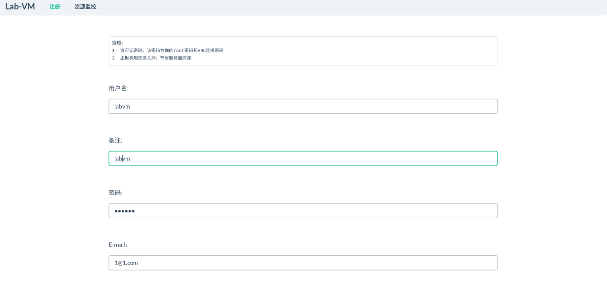
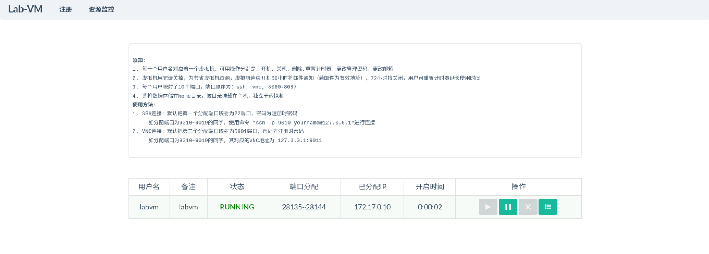

# 实验室虚拟机 （lab_vm, laboratory virtual machine）
为实验室服务器创建多个独立的vnc虚拟机（容器），保证主机安全与数据隔离。

# 特点
* 基于docker，轻量级环境隔离，比传统虚拟机损耗资源小，运行速度更快
* 基于nvidia-docker2，容器内可使用GPU进行深度学习计算（基于cuda9.2 和 cuda8.0 镜像）
* 支持计算资源分配（CPU、内存、硬盘IO，不支持GPU资源分配）
* web 可视化容器管理与资源监控
* 用户容器密码加密

# 运行平台
ubuntu16.04 （其他平台未测试,理论上只要docker和nvidia-docker2安装成功即可）、\
python3、

# 安装条件
* docker >= 1.12 (https://www.docker.com/)
* GNU/Linux x86_64 with kernel version > 3.10
* NVIDIA GPU with Architecture > Fermi (2.1)
* NVIDIA drivers >= 387.26(cuda9.2), >=367.48(cuda8)
* nvidia-docker2 (https://github.com/NVIDIA/nvidia-docker)

# 安装步骤
#### 安装docker 和 nvidia-docker2
从[官网](https://docs.docker.com/install/linux/docker-ce/ubuntu/#install-from-a-package)安装docker \
从[官网](https://github.com/NVIDIA/nvidia-docker)安装nvidia-docker2 \
\# 也可直接安装文件夹内的deb包
#### 载入lab_vm镜像
\# cuda9.2 镜像 \
docker pull kunxinz/lab-vm:xfce_cuda9.2 \
\# cuda8.0 镜像 \
docker pull kunxinz/lab-vm:xfce_cuda8.0 \
\# 除了从docker hub下载，镜像也可通过docker_file文件夹自行修改构建：\
\# docker build -f docker_file/Dockerfile.for_git -t lab_vm:xfce_cuda8_git docker_file

#### 运行Server.py 文件。至此，lab_vm安装完毕
venv/bin/python  Server.py -c lab_vm.conf

# 基本使用步骤
#### 打开浏览器，输入127.0.0.1:28125，即可访问web页面

#### 按照页面提示进行注册

#### 注册成功后如图所示

#### 使用vnc连接端口31021，输入vnc密码，连接成功

#### 执行nvidia_smi，若成功则表示虚拟机可使用显卡

#### 进入资源监控界面，则可观察硬件资源使用情况

# ps
* cuda8.0镜像支持tensorflow版本为1.3.0-1.4.1，对应cudnn版本6.0
* cuda9.2镜像支持tensorflow版本为1.5.0-1.10.0，对应cudnn版本7.0
* 可修改lab_vm.conf配置文件来更改相应参数
* 虚拟机不支持硬件opengl
* nvidia驱动对docker支持不完善，服务器重启容易造成驱动崩溃，需要重装驱动，建议如无必要，不要重启服务器
* 建议更改/etc/docker/daemon.json文件，将docker的dns设为国内的dns以加速访问
* 以上测试平台信息为ubuntu16.04，python3.5，1080Ti，driver_ver=390.67，docker-ce_18.06.1，nvidia-docker2_2.0.3

#### 贡献者
[kunxinz](https://github.com/kunxinz)、
[yuna~](https://github.com/aruyuna9531)、
[KenLee](https://hellokenlee.github.io)、
[Limkuan](https://github.com/WideLee)、
hetao
